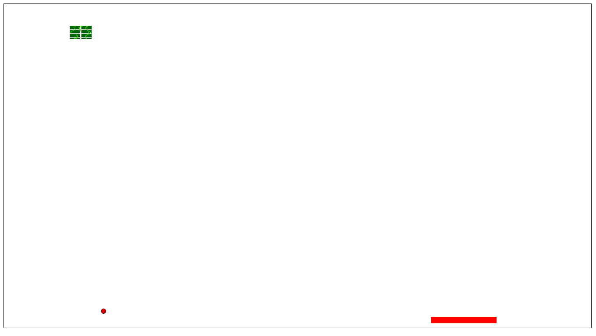

 

# Breakout-Clone

## A copy of the game breakout made in Javascript. 
### The game consists of hitting a ton of bricks with a ball controlled by a paddle.
### If you it all, congratulations you won.
### However if the ball hits the ground three time, you lose.

## How to run the game ?
### Just clone the repo to a code editor and run locally :)
